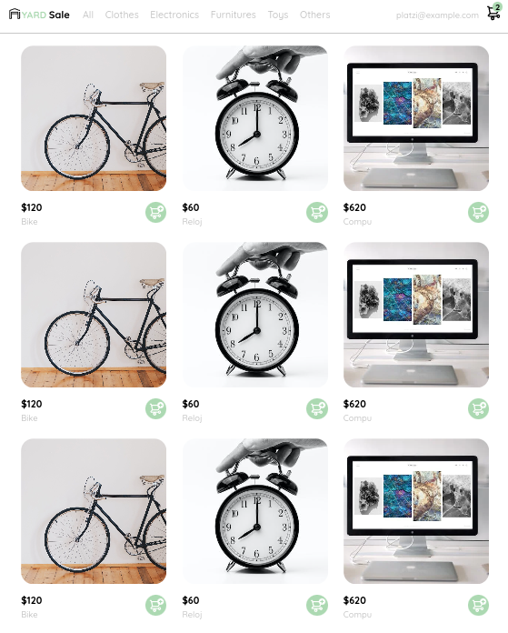

# Curso Práctico de Frontend Developer
---

---
## La maquetación o diagramación web consiste en transformar un diseño gráfico —boceto— (hecho por UX/UI en Figma o Scketch) en una interfaz funcional en términos de programación que entienda un navegador o dispositivo específico.

El área de diseño nos proporcionó el bosquejo del proyecto en Figma.

Podemos identificar las vistas de:

    Inicio
    Creación de cuenta
    Acceso
    Carrito de compras
    Orden de compra
    Detalle de producto
    Menú

En diferenes paginas dentro de pages/ , hicimos los siguientes requerimientos:

## pasos:

- Crear nueva contraseña:HTML,CSS

- Email enviado

- Login

- Crear y editar mi cuenta

- Mi cuenta

- Pagina de inicio: Html,Css

- Menu desktop

- Menu mobile

- Mi orden: Html,Css

- Mis ordenes

- Navbar: Html,Css

- Detalle de producto

- Carrito de compras

## Este curso se continuara en el curso practico de react  